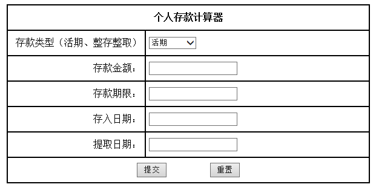
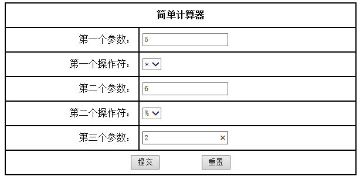
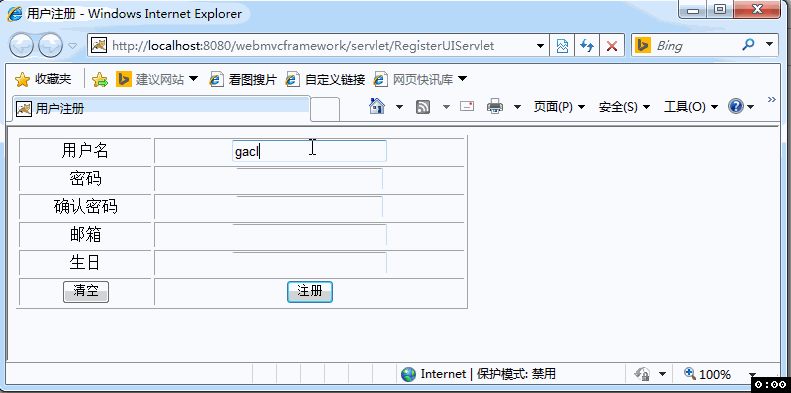

# J2EE_Practice

***

##1.实现个人存款计算器
>-利用JSP+Servlet+JavaBean技术实现个人存款计算器

>-存款类型实现活期和整存整取即可

>-用户在输入相关数据后，根据不同的存款类型在另外一个页面显示所得利息和本息合计总数

>-参考资料http://www.cmbchina.com/CmbWebPubInfo/Cal_Saving_Per.aspx?chnl=ckjsq

***

##2.简单计算器的实现
>-利用JSP+Servlet+JavaBean技术实现如上图简单计算器

>-操作符需实现+、-、*、/、%五种二元运算符

>-用户在输入相关数据后，在另个里面显示计算结果，如：“计算结果：5*6%12=6”

>-参考资料 http://blog.csdn.net/a352193394/article/details/7212402

***

##3.用户注册的实现
>-利用JSP+Servlet+JavaBean技术实现用户注册

>-用户需要填写包括爱好在内的至少4样数据

>-用户在输入相关数据后，在另个里面显示用户填写信息

>-使用JavaBean封装表单数据

>-需要将用户注册信息写在服务器端的文件中（每条注册记录的信息之间用；或空格分开）

>-参考资料：教材例3-23

***

##4.任意进制转换器
>-利用JSP+Servlet+Java Bean技术实现进制之间 的转换

>-至少实现十进制、二进制、八进制和十六进制之间的转换

***

##5.文件信息的统计
>-利用JSP+Servlet+Java Bean技术实现文件信息的统计

>-文件信息至少包括文件名、大小、行数和字数等

***

##6.时间间隔计算
>-利用JSP+Servlet+Java Bean技术实现两个时间之间的间隔

>-计算结果需分别用天、小时、分钟和秒来表示。

